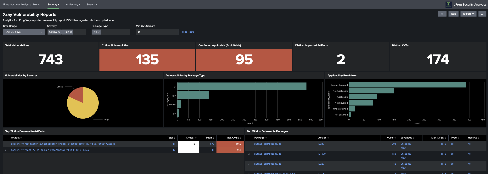

# JFrog Security Analytics for Splunk

A Splunk application providing dashboards, saved searches, and analytics for JFrog Artifactory and Xray security events.

## Screenshots

### Xray Vulnerability Reports Dashboard


*KPI singles, severity breakdown, package-type distribution, applicability analysis, top impacted artifacts, top vulnerable packages, CVE trends, and full filterable detail table — all driven by exported JFrog Xray vulnerability report JSON files.*

## Features

- **Xray Vulnerability Reports** — Full-fidelity ingestion of exported Xray vulnerability report JSON files via scripted input or HEC, with per-row events and flattened CVE fields
- **Xray Security Violations** — Real-time dashboards for critical/high/medium/low violations
- **CVE Analysis** — Track vulnerabilities by CVE across your artifact ecosystem
- **License Violations** — Monitor license policy breaches
- **Artifactory Access Analytics** — Failed authentication detection and access pattern analysis
- **Traffic Analysis** — Artifact download trends and top artifact tracking
- **Alerting** — Pre-built alerts for critical security events

## Prerequisites

- Splunk Enterprise 8.x or higher (or Splunk Cloud)
- JFrog Artifactory 7.x or higher
- JFrog Xray 3.x or higher
- Splunk Add-on for JFrog (for data ingestion) or custom log forwarding configured

## Installation

1. Copy the app directory to `$SPLUNK_HOME/etc/apps/jfrog_security_analytics_for_splunk`
2. Restart Splunk
3. Configure your data inputs in `default/inputs.conf` (or via the Splunk UI under Settings > Data Inputs)
4. Ensure logs are indexed into the `jfrog` index

## Data Sources

| Source Type | Description | Default Index |
|---|---|---|
| `jfrog:artifactory:access` | Artifactory access logs | `jfrog` |
| `jfrog:artifactory:request` | Artifactory request logs | `jfrog` |
| `jfrog:artifactory:traffic` | Artifactory traffic logs | `jfrog` |
| `jfrog:xray:violations` | Xray security violations | `jfrog` |
| `jfrog:xray:siem` | Xray SIEM events | `jfrog` |
| `jfrog:xray:vulnerability_report` | Xray exported vulnerability report JSON (scripted input / HEC) | `jfrog` |

## Directory Structure

```
jfrog_security_analytics_for_splunk/
├── appserver/
│   └── static/
│       └── css/            # Custom CSS styles
├── bin/                    # Helper scripts
├── default/
│   ├── app.conf            # App metadata
│   ├── data/
│   │   └── ui/
│   │       ├── nav/        # Navigation menu
│   │       └── views/      # Dashboard XML files
│   ├── eventtypes.conf     # Event type definitions
│   ├── inputs.conf         # Data input templates
│   ├── macros.conf         # Search macros
│   ├── props.conf          # Source type configuration
│   ├── savedsearches.conf  # Saved searches and alerts
│   ├── tags.conf           # Tag definitions
│   └── transforms.conf     # Field transforms and lookups
├── lookups/                # Lookup table CSV files
├── metadata/
│   └── default.meta        # Object permissions
└── README.md
```

## Configuration

### Index Configuration

By default the app expects logs in the `jfrog` index. To change this, update the macros in `default/macros.conf`:

```ini
[jfrog_xray_violations_index]
definition = index=YOUR_INDEX sourcetype="jfrog:xray:violations"
```

### Customizing Alerts

Edit `default/savedsearches.conf` to adjust alert thresholds and scheduling. Key alerts:

- **JFrog - Xray High and Critical Violations Alert** — Triggers every 15 minutes if new violations exist
- **JFrog - Artifactory Failed Authentication** — Monitors for brute-force patterns

## Support

For issues, feature requests, or contributions, please open an issue in the project repository.
